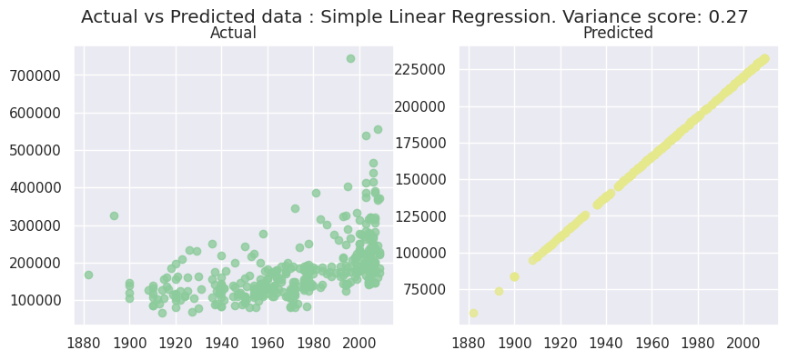
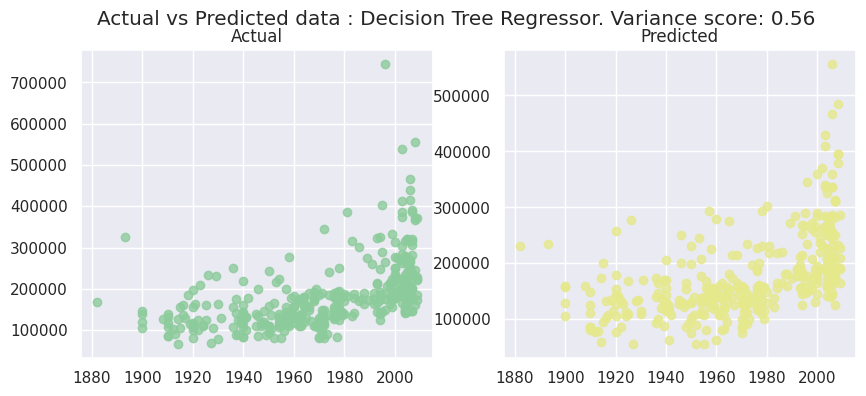

# Regression data using scikit-learn

Regression is when the feature to be predicted contains continuous values. Regression refers to the process of predicting a dependent variable by analyzing the relationship between other independent variables. There are several algorithms known to us that help us in excavating these relationships to better predict the value.

In this notebook, we'll use scikit-learn to predict values. Scikit-learn provides implementations of many regression algorithms. In here, we have done a comparative study of 5 different regression algorithms. 

To help visualize what we are doing, we'll use 2D and 3D charts to show how the classes looks (with 3 selected dimensions) with matplotlib and seaborn python libraries.

Sources: 
- [Machine Learning with Scikit Learn - Regression Exercise](https://ibm.github.io/intro-to-ml-with-sklearn/02-regression/)
- https://github.com/IBM/intro-to-ml-with-sklearn/tree/main/notebooks


<a id="top"></a>
## Table of Contents

1. [Load libraries](#load_libraries)
2. [Helper methods for metrics](#helper_methods)
3. [Data exploration](#explore_data)
4. [Prepare data for building regression model](#prepare_data)
5. [Build Simple Linear Regression model](#model_slr)
6. [Build Multiple Linear Regression classification model](#model_mlr)
7. [Build Polynomial Linear Regression model](#model_plr) 
8. [Build Decision Tree Regression model](#model_dtr) 
9. [Build Random Forest Regression model](#model_rfr)
10. [Comparitive study of different regression algorithms](#compare_classification)

### Quick set of instructions to work through the notebook

If you are new to Notebooks, here's a quick overview of how to work in this environment.

1. The notebook has 2 types of cells - markdown (text) such as this and code such as the one below. 
2. Each cell with code can be executed independently or together (see options under the Cell menu). When working in this notebook, we will be running one cell at a time because we need to make code changes to some of the cells.
3. To run the cell, position cursor in the code cell and click the Run (arrow) icon. The cell is running when you see the * next to it. Some cells have printable output.
4. Work through this notebook by reading the instructions and executing code cell by cell. Some cells will require modifications before you run them. 

<a id="load_libraries"></a>
## 1. Load libraries
[Top](#top)

Install python modules
NOTE! Some pip installs require a kernel restart.
The shell command pip install is used to install Python modules. Some installs require a kernel restart to complete. To avoid confusing errors, run the following cell once and then use the Kernel menu to restart the kernel before proceeding.


```python
!pip -q install seaborn
!pip -q install pydot
```

    
    [notice] A new release of pip available: 22.2.2 -> 23.3.2
    [notice] To update, run: pip install --upgrade pip
    
    [notice] A new release of pip available: 22.2.2 -> 23.3.2
    [notice] To update, run: pip install --upgrade pip


```python
from sklearn.preprocessing import LabelEncoder, OneHotEncoder
from sklearn.impute import SimpleImputer
from sklearn.preprocessing import MinMaxScaler
from sklearn.preprocessing import StandardScaler
from sklearn.compose import ColumnTransformer, make_column_transformer
from sklearn.pipeline import Pipeline

from sklearn.model_selection import train_test_split
from sklearn.metrics import accuracy_score,mean_squared_error, r2_score

import pandas as pd, numpy as np
import sys
import io

import matplotlib.pyplot as plt
from mpl_toolkits.mplot3d import Axes3D
import seaborn as sns
import pydot

```


<a id="helper_methods"></a>
## 2. Helper methods for metrics
[Top](#top)


```python

def two_d_compare(X_test,y_test,y_pred,model_name):
    area = (12 * np.random.rand(40))**2 
    plt.subplots(ncols=2, figsize=(10,4))
    plt.suptitle('Actual vs Predicted data : ' +model_name + '. Variance score: %.2f' % r2_score(y_test, y_pred))

    plt.subplot(121)
    plt.scatter(X_test, y_test, alpha=0.8, color='#8CCB9B')
    plt.title('Actual')

    plt.subplot(122)
    plt.scatter(X_test, y_pred,alpha=0.8, color='#E5E88B')
    plt.title('Predicted')

    plt.show()
    

def model_metrics(regressor,y_test,y_pred):
    mse = mean_squared_error(y_test,y_pred)
    print("Mean squared error: %.2f"
      % mse)
    r2 = r2_score(y_test, y_pred)
    print('R2 score: %.2f' % r2 )
    return [mse, r2]

def two_vs_three(x_test,y_test,y_pred,z=None, isLinear = False) : 
    
    area = 60
    

    fig = plt.figure(figsize=(12,6))
    fig.suptitle('2D and 3D view of sales price data')

    # First subplot
    ax = fig.add_subplot(1, 2,1)
    ax.scatter(x_test, y_test, alpha=0.5,color='blue', s= area)
    ax.plot(x_test, y_pred, alpha=0.9,color='red', linewidth=2)
    ax.set_xlabel('YEAR BUILT')
    ax.set_ylabel('SELLING PRICE')
    
    plt.title('YEARBUILT vs SALEPRICE')
    
    if not isLinear : 
    # Second subplot
        ax = fig.add_subplot(1,2,2, projection='3d')

        ax.scatter(z, x_test, y_test, color='blue', marker='o')
        ax.plot(z, x_test, y_pred, alpha=0.9,color='red', linewidth=2)
        ax.set_ylabel('YEAR BUILT')
        ax.set_zlabel('SELLING PRICE')
        ax.set_xlabel('LOT AREA')

    plt.title('LOT AREA vs YEAR BUILT vs SELLING PRICE')

    plt.show()
    
```

<a id="explore_data"></a>
## 3. Data exploration
[Top](#top)

In the snippet below, we use the pandas library to load a csv that contains housing related information. With several independent variables related to this domain, we are going to predict the sales price of a house. 


```python
df_pd =  pd.read_csv("https://raw.githubusercontent.com/IBM/ml-learning-path-assets/master/data/predict_home_value.csv")
df_pd.head()
```


<div>
<style scoped>
    .dataframe tbody tr th:only-of-type {
        vertical-align: middle;
    }

    .dataframe tbody tr th {
        vertical-align: top;
    }

    .dataframe thead th {
        text-align: right;
    }
</style>
<table border="1" class="dataframe">
  <thead>
    <tr style="text-align: right;">
      <th></th>
      <th>ID</th>
      <th>LOTAREA</th>
      <th>BLDGTYPE</th>
      <th>HOUSESTYLE</th>
      <th>OVERALLCOND</th>
      <th>YEARBUILT</th>
      <th>ROOFSTYLE</th>
      <th>EXTERCOND</th>
      <th>FOUNDATION</th>
      <th>BSMTCOND</th>
      <th>...</th>
      <th>GARAGETYPE</th>
      <th>GARAGEFINISH</th>
      <th>GARAGECARS</th>
      <th>GARAGECOND</th>
      <th>POOLAREA</th>
      <th>POOLQC</th>
      <th>FENCE</th>
      <th>MOSOLD</th>
      <th>YRSOLD</th>
      <th>SALEPRICE</th>
    </tr>
  </thead>
  <tbody>
    <tr>
      <th>0</th>
      <td>1</td>
      <td>8450</td>
      <td>1Fam</td>
      <td>2Story</td>
      <td>5</td>
      <td>2003</td>
      <td>Gable</td>
      <td>TA</td>
      <td>PConc</td>
      <td>TA</td>
      <td>...</td>
      <td>Attchd</td>
      <td>RFn</td>
      <td>2</td>
      <td>TA</td>
      <td>0</td>
      <td>NaN</td>
      <td>NaN</td>
      <td>2</td>
      <td>2008</td>
      <td>208500</td>
    </tr>
    <tr>
      <th>1</th>
      <td>2</td>
      <td>9600</td>
      <td>1Fam</td>
      <td>1Story</td>
      <td>8</td>
      <td>1976</td>
      <td>Gable</td>
      <td>TA</td>
      <td>CBlock</td>
      <td>TA</td>
      <td>...</td>
      <td>Attchd</td>
      <td>RFn</td>
      <td>2</td>
      <td>TA</td>
      <td>0</td>
      <td>NaN</td>
      <td>NaN</td>
      <td>5</td>
      <td>2007</td>
      <td>181500</td>
    </tr>
    <tr>
      <th>2</th>
      <td>3</td>
      <td>11250</td>
      <td>1Fam</td>
      <td>2Story</td>
      <td>5</td>
      <td>2001</td>
      <td>Gable</td>
      <td>TA</td>
      <td>PConc</td>
      <td>TA</td>
      <td>...</td>
      <td>Attchd</td>
      <td>RFn</td>
      <td>2</td>
      <td>TA</td>
      <td>0</td>
      <td>NaN</td>
      <td>NaN</td>
      <td>9</td>
      <td>2008</td>
      <td>223500</td>
    </tr>
    <tr>
      <th>3</th>
      <td>4</td>
      <td>9550</td>
      <td>1Fam</td>
      <td>2Story</td>
      <td>5</td>
      <td>1915</td>
      <td>Gable</td>
      <td>TA</td>
      <td>BrkTil</td>
      <td>Gd</td>
      <td>...</td>
      <td>Detchd</td>
      <td>Unf</td>
      <td>3</td>
      <td>TA</td>
      <td>0</td>
      <td>NaN</td>
      <td>NaN</td>
      <td>2</td>
      <td>2006</td>
      <td>140000</td>
    </tr>
    <tr>
      <th>4</th>
      <td>5</td>
      <td>14260</td>
      <td>1Fam</td>
      <td>2Story</td>
      <td>5</td>
      <td>2000</td>
      <td>Gable</td>
      <td>TA</td>
      <td>PConc</td>
      <td>TA</td>
      <td>...</td>
      <td>Attchd</td>
      <td>RFn</td>
      <td>3</td>
      <td>TA</td>
      <td>0</td>
      <td>NaN</td>
      <td>NaN</td>
      <td>12</td>
      <td>2008</td>
      <td>250000</td>
    </tr>
  </tbody>
</table>
<p>5 rows × 32 columns</p>
</div>


```python
area = 60
x = df_pd['YEARBUILT']
y = df_pd['SALEPRICE']
z = df_pd['LOTAREA']


fig = plt.figure(figsize=(12,6))
fig.suptitle('2D and 3D view of sales price data')

# First subplot
ax = fig.add_subplot(1, 2,1)

ax.scatter(x, y, alpha=0.5,color='blue', s= area)
ax.set_xlabel('YEAR BUILT')
ax.set_ylabel('SELLING PRICE')

plt.title('YEARBUILT vs SALEPRICE')

# Second subplot
ax = fig.add_subplot(1,2,2, projection='3d')

ax.scatter(z, x, y, color='blue', marker='o')

ax.set_ylabel('YEAR BUILT')
ax.set_zlabel('SELLING PRICE')
ax.set_xlabel('LOT AREA')

plt.title('LOT AREA VS YEAR BUILT vs SELLING PRICE')

plt.show()

```


    

    


```python
sns.set(rc={"figure.figsize": (8, 4)}); np.random.seed(0)
ax = sns.histplot(df_pd['SALEPRICE'])
plt.show()
```


    

    


```python

print("The dataset contains columns of the following data types : \n" +str(df_pd.dtypes))

```

    The dataset contains columns of the following data types : 
    ID               int64
    LOTAREA          int64
    BLDGTYPE        object
    HOUSESTYLE      object
    OVERALLCOND      int64
    YEARBUILT        int64
    ROOFSTYLE       object
    EXTERCOND       object
    FOUNDATION      object
    BSMTCOND        object
    HEATING         object
    HEATINGQC       object
    CENTRALAIR      object
    ELECTRICAL      object
    FULLBATH         int64
    HALFBATH         int64
    BEDROOMABVGR     int64
    KITCHENABVGR     int64
    KITCHENQUAL     object
    TOTRMSABVGRD     int64
    FIREPLACES       int64
    FIREPLACEQU     object
    GARAGETYPE      object
    GARAGEFINISH    object
    GARAGECARS       int64
    GARAGECOND      object
    POOLAREA         int64
    POOLQC          object
    FENCE           object
    MOSOLD           int64
    YRSOLD           int64
    SALEPRICE        int64
    dtype: object


Notice below that FIREPLACEQU, GARAGETYPE, GARAGEFINISH, GARAGECOND,FENCE and POOLQC have missing values. 


```python
print("The dataset contains following number of records for each of the columns : \n" +str(df_pd.count()))

```

    The dataset contains following number of records for each of the columns : 
    ID              1460
    LOTAREA         1460
    BLDGTYPE        1460
    HOUSESTYLE      1460
    OVERALLCOND     1460
    YEARBUILT       1460
    ROOFSTYLE       1460
    EXTERCOND       1460
    FOUNDATION      1460
    BSMTCOND        1423
    HEATING         1460
    HEATINGQC       1460
    CENTRALAIR      1460
    ELECTRICAL      1459
    FULLBATH        1460
    HALFBATH        1460
    BEDROOMABVGR    1460
    KITCHENABVGR    1460
    KITCHENQUAL     1460
    TOTRMSABVGRD    1460
    FIREPLACES      1460
    FIREPLACEQU      770
    GARAGETYPE      1379
    GARAGEFINISH    1379
    GARAGECARS      1460
    GARAGECOND      1379
    POOLAREA        1460
    POOLQC             7
    FENCE            281
    MOSOLD          1460
    YRSOLD          1460
    SALEPRICE       1460
    dtype: int64


```python
df_pd.isnull().any()

```


    ID              False
    LOTAREA         False
    BLDGTYPE        False
    HOUSESTYLE      False
    OVERALLCOND     False
    YEARBUILT       False
    ROOFSTYLE       False
    EXTERCOND       False
    FOUNDATION      False
    BSMTCOND         True
    HEATING         False
    HEATINGQC       False
    CENTRALAIR      False
    ELECTRICAL       True
    FULLBATH        False
    HALFBATH        False
    BEDROOMABVGR    False
    KITCHENABVGR    False
    KITCHENQUAL     False
    TOTRMSABVGRD    False
    FIREPLACES      False
    FIREPLACEQU      True
    GARAGETYPE       True
    GARAGEFINISH     True
    GARAGECARS      False
    GARAGECOND       True
    POOLAREA        False
    POOLQC           True
    FENCE            True
    MOSOLD          False
    YRSOLD          False
    SALEPRICE       False
    dtype: bool


<a id="prepare_data"></a>
## 4. Data preparation
[Top](#top)

Data preparation is a very important step in machine learning model building. This is because the model can perform well only when the data it is trained on is good and well prepared. Hence, this step consumes bulk of data scientist's time spent building models.

During this process, we identify categorical columns in the dataset. Categories needed to be indexed, which means the string labels are converted to label indices. These label indices are encoded using One-hot encoding to a binary vector with at most a single one-value indicating the presence of a specific feature value from among the set of all feature values. This encoding allows algorithms which expect continuous features to use categorical features.


```python

#remove columns that are not required
df_pd = df_pd.drop(['ID'], axis=1)

df_pd.head()

```


<div>
<style scoped>
    .dataframe tbody tr th:only-of-type {
        vertical-align: middle;
    }

    .dataframe tbody tr th {
        vertical-align: top;
    }

    .dataframe thead th {
        text-align: right;
    }
</style>
<table border="1" class="dataframe">
  <thead>
    <tr style="text-align: right;">
      <th></th>
      <th>LOTAREA</th>
      <th>BLDGTYPE</th>
      <th>HOUSESTYLE</th>
      <th>OVERALLCOND</th>
      <th>YEARBUILT</th>
      <th>ROOFSTYLE</th>
      <th>EXTERCOND</th>
      <th>FOUNDATION</th>
      <th>BSMTCOND</th>
      <th>HEATING</th>
      <th>...</th>
      <th>GARAGETYPE</th>
      <th>GARAGEFINISH</th>
      <th>GARAGECARS</th>
      <th>GARAGECOND</th>
      <th>POOLAREA</th>
      <th>POOLQC</th>
      <th>FENCE</th>
      <th>MOSOLD</th>
      <th>YRSOLD</th>
      <th>SALEPRICE</th>
    </tr>
  </thead>
  <tbody>
    <tr>
      <th>0</th>
      <td>8450</td>
      <td>1Fam</td>
      <td>2Story</td>
      <td>5</td>
      <td>2003</td>
      <td>Gable</td>
      <td>TA</td>
      <td>PConc</td>
      <td>TA</td>
      <td>GasA</td>
      <td>...</td>
      <td>Attchd</td>
      <td>RFn</td>
      <td>2</td>
      <td>TA</td>
      <td>0</td>
      <td>NaN</td>
      <td>NaN</td>
      <td>2</td>
      <td>2008</td>
      <td>208500</td>
    </tr>
    <tr>
      <th>1</th>
      <td>9600</td>
      <td>1Fam</td>
      <td>1Story</td>
      <td>8</td>
      <td>1976</td>
      <td>Gable</td>
      <td>TA</td>
      <td>CBlock</td>
      <td>TA</td>
      <td>GasA</td>
      <td>...</td>
      <td>Attchd</td>
      <td>RFn</td>
      <td>2</td>
      <td>TA</td>
      <td>0</td>
      <td>NaN</td>
      <td>NaN</td>
      <td>5</td>
      <td>2007</td>
      <td>181500</td>
    </tr>
    <tr>
      <th>2</th>
      <td>11250</td>
      <td>1Fam</td>
      <td>2Story</td>
      <td>5</td>
      <td>2001</td>
      <td>Gable</td>
      <td>TA</td>
      <td>PConc</td>
      <td>TA</td>
      <td>GasA</td>
      <td>...</td>
      <td>Attchd</td>
      <td>RFn</td>
      <td>2</td>
      <td>TA</td>
      <td>0</td>
      <td>NaN</td>
      <td>NaN</td>
      <td>9</td>
      <td>2008</td>
      <td>223500</td>
    </tr>
    <tr>
      <th>3</th>
      <td>9550</td>
      <td>1Fam</td>
      <td>2Story</td>
      <td>5</td>
      <td>1915</td>
      <td>Gable</td>
      <td>TA</td>
      <td>BrkTil</td>
      <td>Gd</td>
      <td>GasA</td>
      <td>...</td>
      <td>Detchd</td>
      <td>Unf</td>
      <td>3</td>
      <td>TA</td>
      <td>0</td>
      <td>NaN</td>
      <td>NaN</td>
      <td>2</td>
      <td>2006</td>
      <td>140000</td>
    </tr>
    <tr>
      <th>4</th>
      <td>14260</td>
      <td>1Fam</td>
      <td>2Story</td>
      <td>5</td>
      <td>2000</td>
      <td>Gable</td>
      <td>TA</td>
      <td>PConc</td>
      <td>TA</td>
      <td>GasA</td>
      <td>...</td>
      <td>Attchd</td>
      <td>RFn</td>
      <td>3</td>
      <td>TA</td>
      <td>0</td>
      <td>NaN</td>
      <td>NaN</td>
      <td>12</td>
      <td>2008</td>
      <td>250000</td>
    </tr>
  </tbody>
</table>
<p>5 rows × 31 columns</p>
</div>


```python
# Defining the categorical columns 
categoricalColumns = df_pd.select_dtypes(include=[object]).columns

print("Categorical columns : " )
print(categoricalColumns)

impute_categorical = SimpleImputer(strategy="most_frequent")
onehot_categorical =  OneHotEncoder(handle_unknown='ignore')

categorical_transformer = Pipeline(steps=[('impute',impute_categorical),('onehot',onehot_categorical)])
```

    Categorical columns : 
    Index(['BLDGTYPE', 'HOUSESTYLE', 'ROOFSTYLE', 'EXTERCOND', 'FOUNDATION',
           'BSMTCOND', 'HEATING', 'HEATINGQC', 'CENTRALAIR', 'ELECTRICAL',
           'KITCHENQUAL', 'FIREPLACEQU', 'GARAGETYPE', 'GARAGEFINISH',
           'GARAGECOND', 'POOLQC', 'FENCE'],
          dtype='object')


```python
# Defining the numerical columns 
numericalColumns = [col for col in df_pd.select_dtypes(include=[float,int]).columns if col not in ['SALEPRICE']]
print("Numerical columns : " )
print(numericalColumns)

scaler_numerical = StandardScaler()

numerical_transformer = Pipeline(steps=[('scale',scaler_numerical)])

```

    Numerical columns : 
    ['LOTAREA', 'OVERALLCOND', 'YEARBUILT', 'FULLBATH', 'HALFBATH', 'BEDROOMABVGR', 'KITCHENABVGR', 'TOTRMSABVGRD', 'FIREPLACES', 'GARAGECARS', 'POOLAREA', 'MOSOLD', 'YRSOLD']


```python
preprocessorForCategoricalColumns = ColumnTransformer(transformers=[('cat', categorical_transformer, categoricalColumns)],
                                            remainder="passthrough")
preprocessorForAllColumns = ColumnTransformer(transformers=[('cat', categorical_transformer, categoricalColumns),('num',numerical_transformer,numericalColumns)],
                                            remainder="passthrough")


#. The transformation happens in the pipeline. Temporarily done here to show what intermediate value looks like
df_pd_temp = preprocessorForCategoricalColumns.fit_transform(df_pd)
print("Data after transforming :")
print(df_pd_temp)

df_pd_temp_2 = preprocessorForAllColumns.fit_transform(df_pd)
print("Data after transforming :")
print(df_pd_temp_2)
```

    Data after transforming :
    [[1.00000e+00 0.00000e+00 0.00000e+00 ... 2.00000e+00 2.00800e+03
      2.08500e+05]
     [1.00000e+00 0.00000e+00 0.00000e+00 ... 5.00000e+00 2.00700e+03
      1.81500e+05]
     [1.00000e+00 0.00000e+00 0.00000e+00 ... 9.00000e+00 2.00800e+03
      2.23500e+05]
     ...
     [1.00000e+00 0.00000e+00 0.00000e+00 ... 5.00000e+00 2.01000e+03
      2.66500e+05]
     [1.00000e+00 0.00000e+00 0.00000e+00 ... 4.00000e+00 2.01000e+03
      1.42125e+05]
     [1.00000e+00 0.00000e+00 0.00000e+00 ... 6.00000e+00 2.00800e+03
      1.47500e+05]]
    Data after transforming :
    [[ 1.00000000e+00  0.00000000e+00  0.00000000e+00 ... -1.59911110e+00
       1.38777489e-01  2.08500000e+05]
     [ 1.00000000e+00  0.00000000e+00  0.00000000e+00 ... -4.89110051e-01
      -6.14438622e-01  1.81500000e+05]
     [ 1.00000000e+00  0.00000000e+00  0.00000000e+00 ...  9.90891347e-01
       1.38777489e-01  2.23500000e+05]
     ...
     [ 1.00000000e+00  0.00000000e+00  0.00000000e+00 ... -4.89110051e-01
       1.64520971e+00  2.66500000e+05]
     [ 1.00000000e+00  0.00000000e+00  0.00000000e+00 ... -8.59110400e-01
       1.64520971e+00  1.42125000e+05]
     [ 1.00000000e+00  0.00000000e+00  0.00000000e+00 ... -1.19109702e-01
       1.38777489e-01  1.47500000e+05]]


```python
# prepare data frame for splitting data into train and test datasets

features = []
features = df_pd.drop(['SALEPRICE'], axis=1)

label = pd.DataFrame(df_pd, columns = ['SALEPRICE']) 
#label_encoder = LabelEncoder()
label = df_pd['SALEPRICE']

#label = label_encoder.fit_transform(label)
print(" value of label : " + str(label))


```

     value of label : 0       208500
    1       181500
    2       223500
    3       140000
    4       250000
             ...  
    1455    175000
    1456    210000
    1457    266500
    1458    142125
    1459    147500
    Name: SALEPRICE, Length: 1460, dtype: int64


<a id="model_slr"></a>
## 5. Simple linear regression
[Top](#top)

This is the most basic form of linear regression in which the variable to be predicted is dependent on only one other variable. This is calculated by using the formula that is generally used in calculating the slope of a line.

y = w0 + w1*x1

In the above equation, y refers to the target variable and x1 refers to the independent variable. w1 refers to the coeeficient that expresses the relationship between y and x1 is it also know as the slope. w0 is the constant cooefficient a.k.a the intercept. It refers to the constant offset that y will always be with respect to the independent variables.

Since simple linear regression assumes that output depends on only one variable, we are assuming that it depends on the YEARBUILT. Data is split up into training and test sets. 


```python
X = features['YEARBUILT'].values.reshape(-1,1)
X_train_slr, X_test_slr, y_train_slr, y_test_slr = train_test_split(X,label , random_state=0)

print("Dimensions of datasets that will be used for training : Input features"+str(X_train_slr.shape)+ 
      " Output label" + str(y_train_slr.shape))
print("Dimensions of datasets that will be used for testing : Input features"+str(X_test_slr.shape)+ 
      " Output label" + str(y_test_slr.shape))
```

    Dimensions of datasets that will be used for training : Input features(1095, 1) Output label(1095,)
    Dimensions of datasets that will be used for testing : Input features(365, 1) Output label(365,)


```python
from sklearn.linear_model import LinearRegression

model_name = 'Simple Linear Regression'

slRegressor = LinearRegression()

slRegressor.fit(X_train_slr,y_train_slr)

y_pred_slr= slRegressor.predict(X_test_slr)

print(slRegressor)
```

    LinearRegression()


```python
print('Intercept: \n',slRegressor.intercept_)
print('Coefficients: \n', slRegressor.coef_)
```

    Intercept: 
     -2517567.3215381317
    Coefficients: 
     [1368.99630631]


```python
two_vs_three(X_test_slr[:,0],y_test_slr,y_pred_slr,None, True)  
```


    

    


```python
two_d_compare(X_test_slr,y_test_slr,y_pred_slr,model_name)
```


    

    


```python
slrMetrics = model_metrics(slRegressor,y_test_slr,y_pred_slr)
```

    Mean squared error: 4830018416.25
    R2 score: 0.27


<a id="model_lrc"></a>
## 6. Build multiple linear regression model
[Top](#top)

Multiple linear regression is an extension to the simple linear regression. In this setup, the target value is dependant on more than one variable. The number of variables depends on the use case at hand. Usually a subject matter expert is involved in identifying the fields that will contribute towards better predicting the output feature.

y = w0 + w1*x1 + w2*x2 + .... + wn*xn

Since multiple linear regression assumes that output depends on more than one variable, we are assuming that it depends on all the 30 features. Data is split up into training and test sets. As an experiment, you can try to remove a few features and check if the model performs any better. 


```python
X_train, X_test, y_train, y_test = train_test_split(features,label , random_state=0)

print("Dimensions of datasets that will be used for training : Input features"+str(X_train.shape)+ 
      " Output label" + str(y_train.shape))
print("Dimensions of datasets that will be used for testing : Input features"+str(X_test.shape)+ 
      " Output label" + str(y_test.shape))
```

    Dimensions of datasets that will be used for training : Input features(1095, 30) Output label(1095,)
    Dimensions of datasets that will be used for testing : Input features(365, 30) Output label(365,)


```python
from sklearn.linear_model import LinearRegression

model_name = 'Multiple Linear Regression'

mlRegressor = LinearRegression()

mlr_model = Pipeline(steps=[('preprocessorAll',preprocessorForAllColumns),('regressor', mlRegressor)])

mlr_model.fit(X_train,y_train)

y_pred_mlr= mlr_model.predict(X_test)

print(mlRegressor)
```

    LinearRegression()


```python
print('Intercept: \n',mlRegressor.intercept_)
print('Coefficients: \n', mlRegressor.coef_)
```

    Intercept: 
     -1.3626368848963542e+17
    Coefficients: 
     [-4.14436268e+13 -4.14436268e+13 -4.14436268e+13 -4.14436269e+13
     -4.14436269e+13 -6.94455415e+15 -6.94455415e+15 -6.94455415e+15
     -6.94455415e+15 -6.94455415e+15 -6.94455415e+15 -6.94455415e+15
     -6.94455415e+15  2.31362206e+15  2.31362206e+15  2.31362206e+15
      2.31362206e+15  2.31362206e+15  2.31362206e+15  1.92077652e+16
      1.92077652e+16  1.92077652e+16  1.92077652e+16  1.92077652e+16
      4.74755720e+16  4.74755720e+16  4.74755720e+16  4.74755720e+16
      4.74755720e+16  4.74755720e+16  8.02224163e+15  8.02224163e+15
      8.02224163e+15  8.02224163e+15  4.74903016e+15  4.74903016e+15
      4.74903016e+15  4.74903016e+15  4.74903016e+15  4.74903016e+15
     -3.15018516e+16 -3.15018516e+16 -3.15018516e+16 -3.15018516e+16
     -3.15018516e+16 -7.78023324e+16 -7.78023324e+16  1.30521239e+15
      1.30521239e+15  1.30521239e+15  1.30521239e+15  1.30521239e+15
      2.09651516e+16  2.09651516e+16  2.09651516e+16  2.09651516e+16
      1.06039249e+16  1.06039249e+16  1.06039249e+16  1.06039249e+16
      1.06039249e+16  5.51999544e+15  5.51999544e+15  5.51999544e+15
      5.51999544e+15  5.51999544e+15  5.51999544e+15  1.18876129e+17
      1.18876129e+17  1.18876129e+17 -8.69664424e+14 -8.69664424e+14
     -8.69664424e+14 -8.69664424e+14 -8.69664424e+14  1.83852909e+16
      1.83852909e+16  1.83852909e+16 -4.00040097e+15 -4.00040097e+15
     -4.00040097e+15 -4.00040097e+15  7.11200000e+03  7.77200000e+03
      1.30580000e+04  1.20340000e+04  4.51500000e+03 -6.64000000e+03
     -6.99200000e+03  2.28600000e+04  1.17280000e+04  1.49920000e+04
      3.23800000e+03 -1.23175000e+03 -1.13600000e+03]


```python
two_vs_three(X_test['YEARBUILT'],y_test,y_pred_mlr,X_test['LOTAREA'], False)  
```


    

    


```python
two_d_compare(X_test['YEARBUILT'],y_test,y_pred_mlr,model_name)
```


    

    


```python
mlrMetrics = model_metrics(slRegressor,y_test,y_pred_mlr)
```

    Mean squared error: 2041955375.89
    R2 score: 0.69


<a id="model_plr"></a>
## 7. Build Polynomial Linear regression model
[Top](#top)

The prediction line generated by simple/linear regression is usually a straight line. In cases when a simple or multiple linear regression does not fit the data point accurately, we use the polynomial linear regression. The following formula is used in the back-end to generate polynomial linear regression.

y = w0 + w1*x1 + w2*x21 + .... + wn*xnn

We are assuming that output depends on the YEARBUILT and LOTATREA. Data is split up into training and test sets. 


```python
X = features.iloc[:, [0,4]].values
X_train, X_test, y_train, y_test = train_test_split(X,label, random_state=0)

print("Dimensions of datasets that will be used for training : Input features"+str(X_train.shape)+ 
      " Output label" + str(y_train.shape))
print("Dimensions of datasets that will be used for testing : Input features"+str(X_test.shape)+ 
      " Output label" + str(y_test.shape))
```

    Dimensions of datasets that will be used for training : Input features(1095, 2) Output label(1095,)
    Dimensions of datasets that will be used for testing : Input features(365, 2) Output label(365,)


```python
from sklearn.linear_model import LinearRegression
from sklearn.preprocessing import PolynomialFeatures

model_name = 'Polynomial Linear Regression'

polynomial_features= PolynomialFeatures(degree=3)
plRegressor = LinearRegression()

plr_model = Pipeline(steps=[('polyFeature',polynomial_features ),('regressor', plRegressor)])

plr_model.fit(X_train,y_train)

y_pred_plr= plr_model.predict(X_test)

print(plRegressor)
```

    LinearRegression()


```python
print('Intercept: \n',plRegressor.intercept_)
print('Coefficients: \n', plRegressor.coef_)
```

    Intercept: 
     7962192.719100944
    Coefficients: 
     [ 0.00000000e+00  5.86667895e+03 -2.85949362e-01  1.21979893e-03
     -6.03747960e+00 -6.54549360e+00  2.54658516e-10 -6.61226593e-07
      1.55487252e-03  2.29378553e-03]


```python
two_vs_three(X_test[:,1],y_test,y_pred_plr,X_test[:,0], False)  
```


    

    


```python
two_d_compare(X_test[:,1],y_test,y_pred_plr,model_name)
```


    

    


```python
plrMetrics = model_metrics(plRegressor,y_test,y_pred_plr)
```

    Mean squared error: 3515419655.46
    R2 score: 0.47


<a id="model_dtr"></a>
## 8. Build decision tree regressor
[Top](#top)


```python

X_train, X_test, y_train, y_test = train_test_split(features,df_pd['SALEPRICE'] , random_state=0)

print("Dimensions of datasets that will be used for training : Input features"+str(X_train.shape)+ 
      " Output label" + str(y_train.shape))
print("Dimensions of datasets that will be used for testing : Input features"+str(X_test.shape)+ 
      " Output label" + str(y_test.shape))
```

    Dimensions of datasets that will be used for training : Input features(1095, 30) Output label(1095,)
    Dimensions of datasets that will be used for testing : Input features(365, 30) Output label(365,)


```python
from sklearn.tree import DecisionTreeRegressor

model_name = "Decision Tree Regressor"

decisionTreeRegressor = DecisionTreeRegressor(random_state=0,max_features=30)

dtr_model = Pipeline(steps=[('preprocessorAll',preprocessorForAllColumns),('regressor', decisionTreeRegressor)]) 

dtr_model.fit(X_train,y_train)

y_pred_dtr = dtr_model.predict(X_test)

print(decisionTreeRegressor)
```

    DecisionTreeRegressor(max_features=30, random_state=0)


```python
two_d_compare(X_test['YEARBUILT'],y_test,y_pred_dtr,model_name)
```


    

    


```python
dtrMetrics = model_metrics(decisionTreeRegressor,y_test,y_pred_dtr)
```

    Mean squared error: 2912093284.03
    R2 score: 0.56


<a id="model_rfr"></a>
## 9. Build Random Forest classification model
[Top](#top)

Decision tree algorithms are efficient in eliminating columns that don't add value in predicting the output and in some cases, we are even able to see how a prediction was derived by backtracking the tree. However, this algorithm doesn't perform individually when the trees are huge and are hard to interpret. Such models are oftern referred to as weak models. The model performance is however improvised by taking an average of several such decision trees derived from the subsets of the training data. This approach is called the Random Forest Regression.


```python
from sklearn.ensemble import RandomForestRegressor

model_name = "Random Forest Regressor"

randomForestRegressor = RandomForestRegressor(n_estimators=100, max_depth=15,random_state=0)

rfr_model = Pipeline(steps=[('preprocessorAll',preprocessorForAllColumns),('regressor', randomForestRegressor)]) 

rfr_model.fit(X_train,y_train)

y_pred_rfr = rfr_model.predict(X_test)

```


```python
two_d_compare(X_test['YEARBUILT'],y_test,y_pred_rfr,model_name)
```


    

    


```python
rfrMetrics = model_metrics(randomForestRegressor,y_test,y_pred_rfr)
```

    Mean squared error: 1320832739.58
    R2 score: 0.80


<a id="compare_classification"></a>
## 10. Comparative study of different regression algorithms. 
[Top](#top)

In the bar chart below, we have compared the performances of different regression algorithms with each other. 
 


```python

n_groups = 1
index = np.arange(n_groups)
bar_width = 1
opacity = 0.8


area = 60 
plt.subplots(ncols=2, figsize=(12,9))
plt.suptitle('Model performance comparison')

plt.subplot(121)
index = np.arange(n_groups)
bar_width = 1
opacity = 0.8

rects1 = plt.bar(index, slrMetrics[0], bar_width,
alpha=opacity,
color='g',
label='Simple Linear Regression')

rects2 = plt.bar(index + bar_width, mlrMetrics[0], bar_width,
alpha=opacity,
color='pink',
label='Multiple Linear Regression')

rects3 = plt.bar(index + bar_width*2, plrMetrics[0], bar_width,
alpha=opacity,
color='y',
label='Polynomial Linear Regression')

rects4 = plt.bar(index + bar_width*3, dtrMetrics[0], bar_width,
alpha=opacity,
color='b',
label='Decision Tree Regression')


rects6 = plt.bar(index + bar_width*4, rfrMetrics[0], bar_width,
alpha=opacity,
color='purple',
label='Random Forest Regression')

plt.xlabel('Models')
plt.ylabel('MSE')
plt.title('Mean Square Error comparison.')
#ax.set_xticklabels(('', 'Simple Lin', 'Multiple Lin', 'Polynomial Lin', 'Decision Tree','Random Forest'))

plt.subplot(122)

rects1 = plt.bar(index, slrMetrics[1], bar_width,
alpha=opacity,
color='g',
label='Simple Linear Regression')

rects2 = plt.bar(index + bar_width, mlrMetrics[1], bar_width,
alpha=opacity,
color='pink',
label='Multiple Linear Regression')

rects3 = plt.bar(index + bar_width*2, plrMetrics[1], bar_width,
alpha=opacity,
color='y',
label='Polynomial Linear Regression')

rects4 = plt.bar(index + bar_width*3, dtrMetrics[1], bar_width,
alpha=opacity,
color='b',
label='Decision Tree Regression')


rects6 = plt.bar(index + bar_width*4, rfrMetrics[1], bar_width,
alpha=opacity,
color='purple',
label='Random Forest Regression')

plt.xlabel('Models')
plt.ylabel('R2')
plt.title('R2 comparison.')
ax.set_xticklabels(('', 'Simple Lin', 'Multiple Lin', 'Polynomial Lin', 'Decision Tree','Random Forest'))


plt.legend()
plt.show()
```

    /tmp/ipykernel_97/3572606802.py:78: UserWarning: FixedFormatter should only be used together with FixedLocator
      ax.set_xticklabels(('', 'Simple Lin', 'Multiple Lin', 'Polynomial Lin', 'Decision Tree','Random Forest'))


    

    


 

<p><font size=-1 color=gray>
&copy; Copyright 2019 IBM Corp. All Rights Reserved.
<p>
Licensed under the Apache License, Version 2.0 (the "License"); you may not use this file
except in compliance with the License. You may obtain a copy of the License at
https://www.apache.org/licenses/LICENSE-2.0
Unless required by applicable law or agreed to in writing, software distributed under the
License is distributed on an "AS IS" BASIS, WITHOUT WARRANTIES OR CONDITIONS OF ANY KIND, either
express or implied. See the License for the specific language governing permissions and
limitations under the License.
</font></p>
