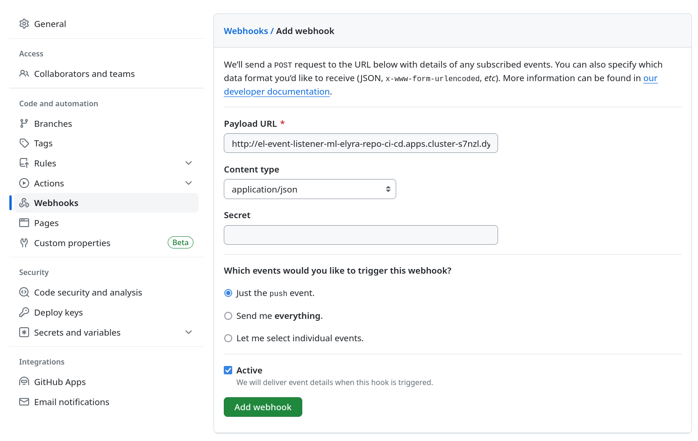

# ML Pipelines with Red Hat OpenShift Data Science

This repository contains the essential manifests for recreating the _ML Pipelines with Red Hat OpenShift Data Science_ pattern.


## Requirements

The pattern within this repository depends on OpenShift and a number of operators. The manifests have been tested with these versions:
- OpenShift Container Platform 4.13.1
- Red Hat OpenShift Pipelines 1.12.1
- Red Hat OpenShift GitOps 1.9.2
- Red Hat OpenShift Data Science 1.33.0

Deploying the pattern requires [Helm v3](https://helm.sh/docs/intro/install/).

To enable git integration of the CI/CD pipelines, create a Github access token with read-write permissions for the pipeline source code and manifest repositories.

## Deploying the pattern

Ensure you're logged into the OpenShift cluster as cluster admin and the required operators are installed (see above).

Edit `values.yaml`:
- Set `clusterdomainurl` to the domain URL of your OpenShift cluster.
- Set `githubtoken` to the token value of the Github access token that grants read-write access to the pipeline source code and manifest repositories.

Deploy the Helm chart:

```
helm install rhods-ml-pipelines .
```

The deployment of all components may take up to 30 minutes.

## Post-configuration

### Prepare data sources

Open the Minio admin console via the `minio-ui` route URL in the `minio` namespace. Log in with `minio` / `minio123`. Navigate to `Buckets` and select `Create Bucket`. Enter `fraud-detection` under bucket name and select `Create Bucket`. Create another one with name `production-data`.

Download the `training-data.csv` file from the [artefacts repository](https://github.com/mamurak/os-mlops-artefacts/tree/main/data/fraud-detection).

Navigate to `Object Browser`. Select `fraud-detection` and click on `Upload`. Select and upload the CSV file you downloaded previously. Upload the same file to the `production-data` bucket.

### CI-RHODS integration

Find the service account token of the pipelines server in the `production-project` namespace. Look for a secret with name starting with `ds-pipeline-pipelines-definition-token-`. Copy its token value and insert it into the `dsp-secret` secret in namespace `ci-cd` as the `token` value in the secret's `conf.json` entry.

### Github-CI integration

In the `ci-cd` namespace, attach the `github-token` secret to the `pipeline` service account.

Copy the route URL of the `el-event-listener-ml-elyra-repo` route. Create a new webhook in the elyra pipeline code repository and insert the previous URL into the `Payload URL` field. Choose content type `application/json` and add the webhook.



Repeat the previous step with the `el-event-listener-kfp-pipeline-repo` route URL to create a Github webhook at the KFP pipeline code repository.

### Initialize production pipelines

In the RHODS dashboard, navigate to the `production-project` project. Under Pipelines, select `Import pipeline`. In the `Pipeline name` field enter `model-training`. Click `Upload` and select `elyra-pipeline-0.yaml`. Select `Open` and finish import via `Import pipeline`.

Repeat the previous step uploading the `kfp-pipeline-0.yaml` file and assigning the name `model-training-kfp`.

## Running the end-to-end workflow

### Developing and deploying Elyra pipelines

1. In the RHODS dashboard, navigate to project `fraud-detection` and enter workbench `JupyterLab`.
2. Clone the [pipeline code repository](REPO_URL) if it's not cloned already.
3. Within the repository folder, change the pipeline code within any of the Python modules. You may test the code by running the `training-workflow.ipynb` Jupyter notebook.
4. Open the `model-training.pipeline` Elyra pipeline. Select `Run Pipeline` in the top toolbar and click on `OK`. This will submit the pipeline to Data Science Pipelines for pipeline testing.
5. Click on `Run Details` to observe pipeline execution in the RHODS dashboard in real-time.
6. Once you have verified that the pipeline runs until completion, return to the workbench. Open the git client in the left toolbar. Commit your pipeline code changes and push them to the git server.
7. Open the OpenShift web console in the Administrator view and navigate to `Pipelines` -> `Pipelines` -> `PipelineRuns` -> Project: `ci-cd`. You should see a new pipeline run name starting with `ml-pipeline-ci-cd-`. Click on it and observe in real-time how the new pipeline source code is checked out, converted into a Tekton `PipelineRun` and staged using the "production" Data Science Pipelines server.
8. Once the pipeline has run until completion, return to the RHODS dashboard. Navigate to `Data Science Pipelines` -> `Pipelines` -> Project: `production-project`. Select `model-training`. You can now see the latest pipeline version, staged for production.
9. To trigger the pipeline, select `Actions` -> `Create run`. Enter a name and click `Create`. You should now see how the staged pipeline is executed in real-time, using the parameters of the `production-project` instance.

### Developing and deploying native Kubeflow pipelines

1. In the RHODS dashboard, navigate to project `fraud-detection` and enter workbench `VS Code`.
2. Clone the [pipeline code repository](REPO_URL) if it's not cloned already.
3. Within the repository folder, change the pipeline code within the `model_training_kfp_pipeline.py` module.
4. Run the module as a Python script. This will submit the pipeline to Data Science Pipelines for pipeline testing.
5. In the RHODS dashboard, navigate to `Data Science Pipelines` -> `Runs` -> `Triggered` and select the latest `model-training` pipeline run to observe pipeline execution in real-time.
6. Once you have verified that the pipeline runs until completion, return to the workbench. Commit your pipeline code changes and push them to the git server.
7. Open the OpenShift web console in the Administrator view and navigate to `Pipelines` -> `Pipelines` -> `PipelineRuns` -> Project: `ci-cd`. You should see a new pipeline run name starting with `ml-pipeline-ci-cd-kfp-`. Click on it and observe in real-time how the new pipeline source code is checked out, converted into a Tekton `PipelineRun` and staged using the "production" Data Science Pipelines server.
8. Once the pipeline has run until completion, return to the RHODS dashboard. Navigate to `Data Science Pipelines` -> `Pipelines` -> Project: `production-project`. Select `kfp-sample-pipeline`. You can now see the latest pipeline version, staged for production.
9. To trigger the pipeline, select `Actions` -> `Create run`. Enter a name and click `Create`. You should now see how the staged pipeline is executed in real-time, using the parameters of the `production-project` instance.

## References

### Container images

The `container-images` folder contains the sources of the used custom container images:
- `elyra-kfp-tekton-runtime`: runtime of the CI pipelines,
- `fraud-detection`: JupyterLab workbench with Elyra and runtime container used within the Elyra pipeline,
- `fraud-detection-kfp`: VS Code workbench with KFP SDK and runtime container used within the resulting pipeline.

### Documentation and further references

- [Official RHODS documentation](https://access.redhat.com/documentation/en-us/red_hat_openshift_data_science_self-managed)
- [How to build custom workbench images](https://ai-on-openshift.io/odh-rhods/custom-notebooks/)
- [Elyra Pipelines](https://elyra.readthedocs.io/en/v3.15.0/user_guide/pipelines.html)
- [Kubeflow Pipelines SDK](https://www.kubeflow.org/docs/components/pipelines/v1/sdk/)