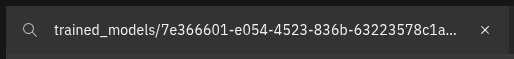
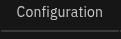
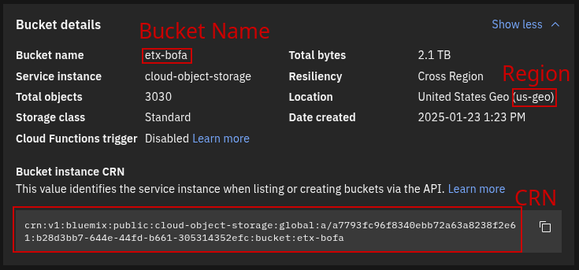
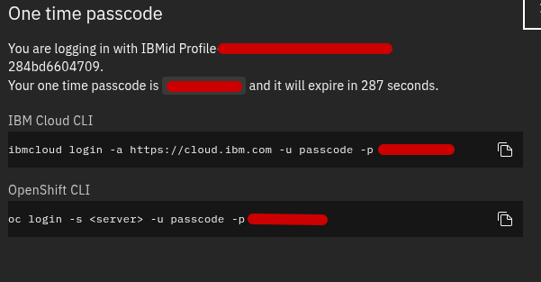

# Model COS CI Pipeline

### IBM COS via temporary passcode

1. Navigate to the  page
2. Find your model in the list and click  in the Object storage column
3. The Filter bar above your objects is pre-populated with the prefix for your model files inside the bucket. You need to update the pipeline parameter with this value, so copy from the field:
    - 
    - `cos-model-prefix` should be updated to reflect this value
4. Click on  in the navigation bar under the bucket name
5. In the `Bucket Details` section, recover the following:
    - 
6. In the Secret, you'll need to update the following:
    - `cos-instance-region` with the region called out
    - `cos-bucket` with the bucket name called out
    - `cos-instance-crn` with the Bucket CRN
7. When you are prepared to create the pipeline parameter with these updates, it's time to recover the temporary passcode for signing in. This passcode is only valid for five minutes, so you'll want to create the pipeline parameter very quickly after getting this temporary passcode.
    1. In the very top-right of the IBM Cloud navigation bar, click the Profile icon ()
    2. Select "Log in to CLI and API" from the menu
    3. Copy the one time passcode, only, without any extra flags, from any of the fields on the dialog, to update the pipeline parameter
        - 
        - `cos-temporary-password` updated with this value
