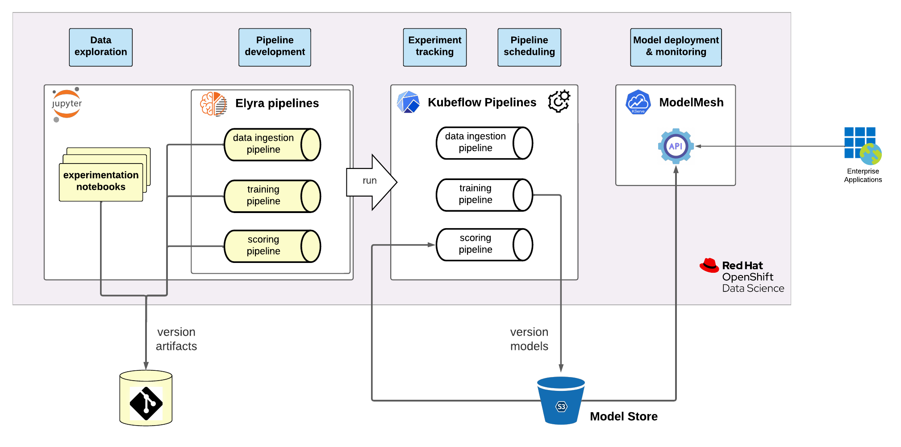

# Table of contents

1. [High-level architecture](#high-level-architecture)
2. [Getting started](#getting-started)
   - [Prerequisites](#Prerequisites)
   - [Deploying the environment](#deploying-the-environment)
   - [Configure the Elyra environment](#configure-the-elyra-environment)
3. [How-To](#how-to)
4. [Troubleshooting](#troubleshooting)
5. [Folder structure](#folder-structure)
6. [References](#references)

# High-level architecture

# Getting started

## Prerequisites

- OpenShift Container Platform version 4.10 or above.
- OpenShift Pipelines operator version 1.7.2 or above.
- OpenShift GitOps operator.
- OpenShift Data Foundation storage cluster.
- A fork of the [ops repository](https://github.com/mamurak/odh-ml-pipelines-seldon-ops-repo) and RW credentials to it.

### Restricted access to Internet

There are multiple artifacts from Github that will need to be downloaded while setting up and running the environment. In case Github is not accessible from the OpenShift cluster, make the following files available on a file server that is accessible from the OpenShift cluster:

- the [ODH 1.4 manifests](https://github.com/opendatahub-io/odh-manifests/tarball/v1.4),
- the Elyra bootstrap files located in `manifests/elyra/`.

## Deploying the environment

### Install Red Hat OpenShift Data Science

- Create a new project `odh-applications`.
- Install the Open Data Hub operator from the Operator Hub.
- Select Open Data Hub operator in Installed Operators within project `odh-applications`.
- Deploy `manifests/odh/odh.yaml` via "Create instance" of Open Data Hub tile.
- After all components have been deployed, scale down the `opendatahub-operator` pod to 0 in the `openshift-operators` project. This is required so we can freely configure the ODH components.
- Adapt and deploy `manifests/odh/odh-admins.yaml`, defining all users that should receive ODH admin permissions.
- Verify the deployment by opening the `odh-dashboard` route URL. You should see the ODH dashboard. If your user is included in the ODH admin group, you should see the `Settings` tab in the dashboard.
- Verify that ML Pipelines is deployed correctly by opening the `ds-pipeline-ui` route. You should see the Kubeflow Pipelines GUI.

### Set up Elyra notebook

- As an ODH admin user, open the `Settings` tab in the ODH dashboard.
- Select `Notebook Images` and `Import new image`.
- Add new notebook with repository URL `quay.io/mmurakam/elyra-notebook:elyra-notebook-v0.3.0` and name `Elyra KFNBC`.
- Verify Elyra notebook integration in the notebook spawn page. You should be able to provision an instance of the Elyra KFNBC notebook.

### Prepare the model deployment

- Deploy `manifests/inference/argocd.yaml`.
- Deploy `manifests/inference/inference-service-app-project.yaml`.
- Deploy `manifests/inference/inference-server-application.yaml`.
- Update and deploy `manifests/inference/storage-config-secret.yaml`.

## Configure the Elyra environment

### If access to internet is restricted

- Ensure Elyra bootstrap files are hosted as described [above](#restricted-access-to-internet).
- Access JupyterHub spawner page (ODH dashboard -> Launch JupyterHub application).
- Add the following environment variables
  - `ELYRA_BOOTSTRAP_SCRIPT_URL`: URL of hosted `bootstrapper.py`
  - `ELYRA_PIP_CONFIG_URL`: URL of hosted `pip.conf`
  - `ELYRA_REQUIREMENTS_URL`: URL of hosted `requirements-elyra.txt`
  - `ELYRA_REQUIREMENTS_URL_PY37`: URL of hosted `requirements-elyra-py37.txt`
- TODO: move this configuration into the custom notebook image.

### Prepare backend services

* Deploy `manifests/odh/ds-pipeline-ui-service.yaml`.
* In project `openshift-storage` deploy `manifests/odh/s3-http-route.yaml` if using OpenShift Data Foundation.

### Set up runtime

* Launch Elyra KFNBC notebook in the Jupyter spawner page.
* Open Runtimes configuration (`Runtime` in left toolbar).
* Next to `Default`, select `Edit`.
* Update the `Kubeflow Pipelines` settings as shown below. In case of RHODS, replace `odh-applications` with `redhat-ods-applications`.
- Deploy `manifests/odh/kfp/ds-pipeline-ui-service.yaml`.
- In project `openshift-storage` deploy `manifests/odh/odf/s3-http-route.yaml`.

### Set up runtime

- Launch Elyra KFNBC notebook in the Jupyter spawner page.
- Open Runtimes configuration (`Runtime` in left toolbar).
- Next to `Default`, select `Edit`.
- Update the `Kubeflow Pipelines` settings as shown below.

### Configure pipeline

- Update and deploy `manifests/odh/demo-pipeline-secret.yaml`:
  - `s3_endpoint_url`: your S3 endpoint URL such as `http://s3.openshift-storage.svc.cluster.local`
  - `s3_accesskey`: S3 access key with bucket creation permissions, for example value of `AWS_ACCESS_KEY_ID` in secret `noobaa-admin` in project `openshift-storage`.
  - `s3_secret_key`: corresponding S3 secret key, for example value of `AWS_SECRET_ACCESS_KEY_ID` in secret `noobaa-admin` in project `openshift-storage`.
  - `ops_repo_location`: the git URL of your ops repo fork.
  - `git_user`: git user with RW permissions to your ops repo fork. Omit if using token-based authentication.
  - `git_password`: password or RW token for git user.

# Run the pipeline

- Enter or launch the Elyra KFNBC notebook in the Jupyter spawner page.
- Clone this repository.
  - Open git client (`Git` in left toolbar).
  - Select `Clone a Repository`.
  - Enter the repository URL `https://github.com/mamurak/os-mlops.git` and select `Clone`.
  - Authenticate if necessary.
- Open `odh-kfp-seldon/notebooks/pipeline-example/demo.pipeline` in the Kubeflow Pipeline Editor.
- Select `Run Pipeline` in the top toolbar.
- Select `OK`.
- Monitor pipeline execution in the Kubeflow Pipelines user interface (`ds-pipelines-ui` route URL) under `Runs`.

# How-To

- Change the available notebook deployment sizes.

  - Find the `odh-dashboard-config` object of kind `OdhDashboardConfig` in project `odh-applications`.
  - Add or update the `spec.notebookSizes` property. Check `manifests/odh/odh-dashboard-config.yaml` for reference.

- Clone git repositories with JupyterLab.

  - Open git client (`Git` in left toolbar).
  - Select `Clone a Repository`.
  - Enter the repository URL and select `Clone`.
  - Authenticate if necessary.

- Build and add custom notebook

  - Deploy `manifests/odh/images/custom-notebook-is.yaml`.
  - Deploy `manifests/odh/images/custom-notebook-bc.yaml`.
  - Trigger build of the new build config and wait until build finishes.
  - As an ODH admin user, open the `Settings` tab in the ODH dashboard.
  - Select `Notebook Images` and `Import new image`.
  - Add new notebook with repository URL `custom-notebook:latest` and appropriate metadata.
  - Verify custom notebook integration in the JupyterHub provisioning page. You should be able to provision an instance of the custom notebook that you have defined in the previous step.

- Add packages to custom notebook image with pinned versions.

  - Within a custom notebook instance, install the package through `pip install {your-package}`.
  - Note the installed version of the package.
  - Add a new entry in `container-images/custom-notebook/requirements.txt` with `{your-package}=={installed-version}`.
  - Trigger a new image build.
  - Once the build is finished, provision a new notebook instance using the custom notebook image. The new package is now available.

- Create Elyra pipelines within JupyterLab.

  - Open the Launcher (blue plus symbol on top left corner of the frame).
  - Select `Kubeflow Pipeline Editor`.
  - Drag and drop notebooks from the file browser into the editor.
  - Build a pipeline by connecting the notebooks by drawing lines from the output to input ports of the node representation. Any directed acyclic graph is supported.
  - For each node, update the node properties (right click on node and select `Open Properties`):
    - `Runtime Image`: Select the appropriate runtime image containing the runtime dependencies of the notebook.
    - `File Dependencies`: If the notebook expects a file to be present, add this file dependency here. It must be present in the file system of the notebook instance.
    - `Environment Variables`: If the notebook expects particular environment variables to be set, you can set them here.
    - `Kubernetes Secrets`: If you would like to set environment variables through Kubernetes secrets rather than defining them in the Elyra interface explicitly, you can reference the environment variables through the corresponding secrets in this field.
    - `Output Files`: If the notebook generates files that are needed by downstream pipeline nodes, reference these files here.
  - Save the pipeline (top toolbar).

- Submit Elyra pipeline to Kubeflow Pipelines backend.
  - Open an existing pipeline within the Elyra pipeline editor.
  - Select `Run Pipeline` (top toolbar).
  - Select the runtime configuration you have prepared before and click `OK`.
  - You can now monitor the pipeline execution within the Kubeflow Pipelines GUI under `Runs`.

# Troubleshooting

- If you don't have cluster admin privileges and you're denied access to the ML Pipelines UI route, you may have to update the oauth proxy arguments in the `ds-pipeline-ui` deployment. Refer to `manifests/odh/ds-pipeline-ui-deployment.yaml` for details.

# Folder structure

- `manifests`: OpenShift deployment artifacts.
- `container-images`: dependencies of container builds.
- `notebooks`: scripts and sample procedures for ODH component integration.

Noteworthy notebook examples in the `notebooks` folder:

- `starburst-odf examples`: Examples of how to interact with S3 buckets and Starburst Enterprise Platform from a Jupyter notebook.
- `elyra examples`: A sample pipeline demonstrating how to create artifacts that can be visualized in Kubeflow Pipelines.
- `batch pipeline example`: A sample pipeline demonstrating parallel batch processing with Seldon.
- `pipeline example`: A sample end-to-end ML pipeline including feature extraction, model training and model deployment through GitOps.

# References

- [OpenShift Container Platform](https://docs.openshift.com/container-platform/4.10/welcome/index.html)
- [Open Data Hub](https://opendatahub.io/) ([Github](https://github.com/opendatahub-io/odh-manifests))
- [JupyterHub](https://jupyterhub.readthedocs.io/en/latest/)
- [Elyra](https://elyra.readthedocs.io/en/stable/)
- [Kubeflow Pipelines](https://www.kubeflow.org/docs/components/pipelines/v1/introduction/)
- [Model Mesh](https://github.com/kserve/modelmesh-serving/blob/main/docs/quickstart.md)
- [OpenShift GitOps](https://docs.openshift.com/container-platform/4.10/cicd/gitops/understanding-openshift-gitops.html)
